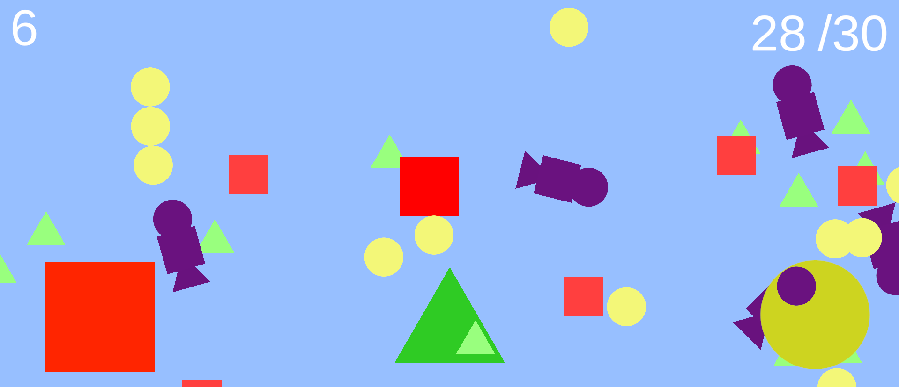

ゲーム制作技術総合実習 個人ワーク
（Circle, Triangle, Squareを使用した2Dゲーム）

# クッツワケ

## ゲームの内容
フィールド上に出てくる丸、三角、四角の敵をプレイヤーにくっつけてエリアに持っていきスコアを上げる
プレイヤー、敵、エリアの形が同じでないとスコアは上がらない（紫の敵に触れるとスコアがマイナスされる）
エリアに触れるとくっついている敵は全て消える
キャラを切り替えるとくっついている敵は全て消える
制限時間内に30以上のスコアを取るとゲームクリア

## 操作説明
移動方法
-WASDまたは矢印キー
キャラチェンジ
-■四角 Jキー
-▲三角 Kキー　
-●丸 Lキー
